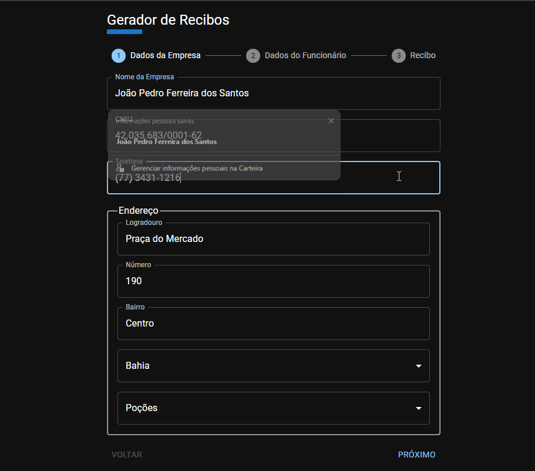

# Gerador de Recibos

Aplicação para gerar recibos simplificados de salário, férias e décimo terceiro.



## Tecnologias

- [Vite Boilerplate](https://github.com/diasjoaovitor/vite-boilerplate)
- [MUI](https://mui.com//)
- [Axios](https://github.com/axios/axios)
- [Extenso](https://github.com/portujs/extenso.js#readme)
- [PDFMake](http://pdfmake.org/#/)

## Como rodar o projeto

```sh
git clone https://github.com/diasjoaovitor/gerador-de-recibos
cd gerador-de-recibos
npm i
npm run dev
```
